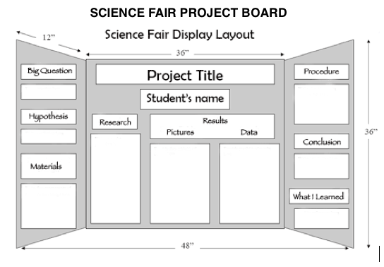

# Your Presentation

A tri-fold display board will be provided for you.

Having a well organized and neat display will make it easier to present your
project and for others to understand what you researched.

Items to include on your presentation:

  * **Your project title**
  * **Your name and grade**
  * What was your hypothesis?
  * Did you collect any data?
  * Do you have any pictures?
  * Did you follow any particular procedure?
  * Did you reach a conclusion?

Here's an example on how to layout your poster:

